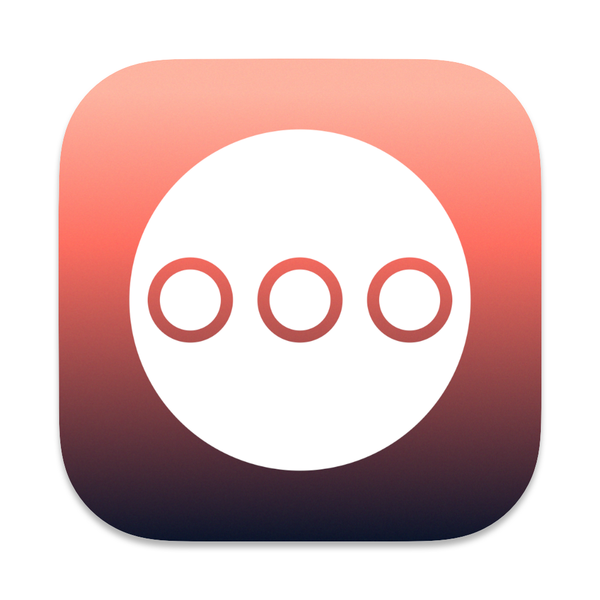

<p align="center">
  
</p>

# Wigglegram Creator

Wigglegram Creator is a simple, user-friendly application for generating animated GIFs and looping MP4 videos from a sequence of images. It features a modern drag-and-drop interface built with PySide6 (Qt for Python).

## Features
- **Drag-and-drop GUI**: Easily add images for processing.
- **Animated GIF output**: Downscaled for easy sharing.
- **Looping MP4/WebM video output**: Full resolution, with configurable repetitions.
- **Export crop**: Draw a crop box on the preview and apply it before scaling, Topaz interpolation, and export.
- **Topaz Apollo Fast slowdown on macOS**: When Topaz Video's bundled `ffmpeg` is detected, export with Apollo Fast slow motion from 2x to 8x.
- **Preview cadence overlay**: Preview approximates the slowed-down source-frame cadence and displays the effective preview frame rate.
- **Cross-platform**: Runs on Windows, Linux, and macOS.

## Installation

### Download a prebuilt app (easiest)

Grab the latest build for your platform from the [Releases page](https://github.com/wjhrdy/wigglegram_creator/releases). Builds are produced automatically for Linux, Windows, and macOS (both Intel and Apple Silicon).

> **macOS:** the app is unsigned, so Gatekeeper will quarantine it. See [Opening the app on macOS](#opening-the-app-on-macos) below.

### Using uv

1. Install `uv` (if you don't have it):
   ```bash
   curl -sSf https://astral.sh/uv/install.sh | sh
   ```
   Follow the on-screen instructions to add `uv` to your PATH.

2. Run the GUI directly from the repository (no manual clone needed):
   ```bash
   uvx --from git+https://github.com/wjhrdy/wigglegram_creator wigglegram-creator
   ```

### Using pip

```bash
pip install git+https://github.com/wjhrdy/wigglegram_creator.git
```

## Usage

Launch the GUI:

```bash
wigglegram-creator
# or enable debug mode (exports debug masks)
wigglegram-creator --debug
```

> **Note:** Wigglegram Creator is a GUI-only application. Images are added by dragging and dropping them onto the window — there is no headless command-line export mode.

## Opening the app on macOS

The prebuilt macOS app is not signed or notarized, so the first time you open it macOS will quarantine it and show a warning like *"Wigglegram Creator can't be opened because Apple cannot check it for malicious software."* There are two ways around this:

**Option 1 — Right-click to open (no terminal):**

1. Move `Wigglegram Creator.app` to your `Applications` folder.
2. Right-click (or Control-click) the app and choose **Open**.
3. In the dialog that appears, click **Open** again. macOS remembers this choice for future launches.

**Option 2 — Remove the quarantine attribute (terminal):**

```bash
xattr -dr com.apple.quarantine "/Applications/Wigglegram Creator.app"
```

Then open the app normally.

## Development

1. **Clone the repository:**
   ```sh
   git clone <repo-url>
   cd wigglegram_creator
   ```
2. **Install dependencies:**
   ```sh
   uv sync
   ```
3. **Run the app:**
   ```sh
   uv run python create_wiggle.py
   ```

### Automated Builds (GitHub Actions)

The [`.github/workflows/build.yml`](.github/workflows/build.yml) workflow builds the app with PyInstaller for Linux, Windows, and macOS (Intel + Apple Silicon). It runs in two ways:

- **On a version tag** (`git tag v1.2.3 && git push --tags`): builds every platform and publishes a GitHub Release with the zipped artifacts attached.
- **Manually** from the **Actions → Build and Release → Run workflow** button (`workflow_dispatch`): builds every platform and uploads the zips as workflow artifacts, without creating a release.

### Manual Build (Advanced)
If you want to build the app yourself locally:

1. **(Recommended) Set up your environment with [uv](https://github.com/astral-sh/uv):**
   ```sh
   uv sync
   ```
2. **Build the app:**
   - **Windows:**
     ```sh
     uv run pyinstaller specs/windows.spec
     ```
   - **macOS:**
     ```sh
     uv run pyinstaller specs/macos.spec
     ```
   - **Linux:**
     ```sh
     uv run pyinstaller specs/linux.spec
     ```
   The executable or bundle will be created in the `dist/` folder.

## Using the App
- **Drag and drop** one or more images (JPG/PNG) onto the app window.
- **Slice** the image using grid in the top left
- **Click on the image** where you want the center of the wiggle to be
- **Scroll** to change the size of the area to focus on and refine the wiggle
- **Choose** the output scale, fps, and number of video repetitions
- **Set Crop** to draw an export crop over the preview; use **Clear Crop** to remove it
- **Topaz Slowdown** appears on macOS when Topaz Video is installed, and uses Apollo Fast for 2x-8x slow motion
- **Export as** GIF or MP4 or WebM

### Topaz Slowdown

On macOS, Wigglegram Creator looks for Topaz Video's bundled `ffmpeg` at:

```text
/Applications/Topaz Video.app/Contents/MacOS/ffmpeg
```

If found, the GUI shows **Topaz Slowdown**. The app interpolates only the forward frame sequence once, then reuses those frames for pingpong and repeated video exports. For example, a 4-frame sequence in pingpong mode is interpolated as `1-2-3-4` first, then mirrored to create the reverse half.

The default export settings are 30 fps, 4x slowdown, and 10 repetitions. With 30 fps and 4x slowdown, the preview cadence is approximately 7.5 source frames per second.

## License
MIT

Forked from https://github.com/nallic/wigglegram_creator
